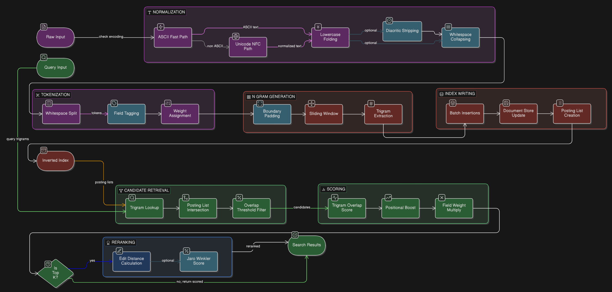

# Lattice

> A lightweight, high-performance fuzzy search engine in Rust using trigram indexing and inverted indexes.

---

## Features

| Feature | What it does |
|---------|-------------|
| Trigram indexing | Indexes text by 3-character sequences for fast fuzzy matching |
| ASCII fast-path | Skips Unicode overhead when input is plain ASCII |
| Unicode support | Handles accented characters, normalizes text consistently |
| Smart preprocessing | Optionally strips accents and cleans up extra spaces |
| Field weights | Give titles more importance than body text |
| Positional scoring | Matches at the start of words score higher |
| Efficient reranking | Expensive edit distance only runs on best candidates |
| Lightweight | Few dependencies, compiles quickly |
| SIMD acceleration | AVX2/SSE2 optimizations on x86_64 for 2-4 GiB/s throughput |
| Zero-allocation | Tokenizer uses callbacks, no intermediate collections |

---

## Quick Start

```rust
use lattice_core::Lattice;

fn main() {
    let mut engine = Lattice::new();

    engine.add(1, "hello world");
    engine.add(2, "hallo werld");
    engine.add(3, "rust programming");

    let results = engine.search("helo world", 5);

    for r in results {
        println!("doc={} score={}", r.doc_id, r.score);
    }
}
```

---

## Installation

Add to your `Cargo.toml`:

```toml
[dependencies]
lattice-core = { path = "lattice-core" }
```

Or if published to crates.io:

```toml
[dependencies]
lattice-core = "0.1"
```

---

## Architecture Overview

**Preprocessing** — Normalization, tokenization, and n-gram generation:
- **Normalization**: ASCII fast-path (SIMD lowercase conversion) or Unicode cold-path → lowercase folding → optional diacritic stripping and whitespace collapsing
- **Tokenization**: Zero-allocation whitespace split with `memchr` SIMD acceleration → field tagging → position tracking
- **N-gram generation**: Boundary padding (optional) → sliding window → trigram extraction

**Indexing** — Batch insertions update the document store and create posting lists that populate the inverted index.

**Retrieval** — Query trigrams lookup posting lists, then candidate retrieval intersects lists and filters by overlap threshold. Scoring applies trigram overlap, positional boost, and field weight multiplication. Reranking (optional) runs edit distance and Jaro-Winkler on top-K candidates.

Documents and queries share the same preprocessing pipeline.



---

## Text Processing Pipeline

### 1. Normalization (`TextNormalizer`)

Converts messy input into clean, normalized text:

```rust
use lattice_core::analyzer::normalizer::{TextNormalizer, NormalizerConfig};

// Default: lowercase + whitespace normalization
let normalizer = TextNormalizer::default();
assert_eq!(normalizer.normalize("  HELLO   WORLD  "), "hello world");

// With diacritic stripping for accent-insensitive search
let config = NormalizerConfig { strip_diacritics: true };
let stripper = TextNormalizer::new(config);
assert_eq!(stripper.normalize("Café résumé"), "cafe resume");
```

**Features:**
- SIMD-accelerated (AVX2: 32 bytes, SSE2: 16 bytes on x86_64)
- Unicode-aware lowercase conversion
- Whitespace collapsing (tabs, newlines → single spaces)
- Leading/trailing whitespace trimming
- Optional Latin-1 diacritic stripping (80+ characters)

**Output Contract:**
- All lowercase
- No leading/trailing whitespace
- No consecutive whitespace
- Valid UTF-8

### 2. Tokenization (`Tokenizer`)

Splits normalized text into tokens with zero allocation:

```rust
use lattice_core::analyzer::tokenizer::{Tokenizer, Field};

let tokenizer = Tokenizer::new(Field::Body);

// Callback-based (zero allocation)
tokenizer.tokenize("hello world", |text, field, position| {
    println!("Token: '{}' at position {} in {:?}", text, position, field);
});
```

**Field Weights:**
| Field | Weight | Use Case |
|-------|--------|----------|
| `Title` | 3.0x | Document titles |
| `Tag` | 2.0x | Tags, categories |
| `Body` | 1.0x | Main content |

**Features:**
- Zero-allocation (tokens are slices)
- SIMD-accelerated space finding via `memchr`
- Position tracking (u32)
- Input contract validation (debug builds)

---

## Configuration

### Normalizer Configuration

```rust
use lattice_core::analyzer::normalizer::NormalizerConfig;

let config = NormalizerConfig {
    strip_diacritics: true,  // "café" → "cafe"
};
```

**Default:** `strip_diacritics: false`

---

## Project Structure

```
lattice/
├── Cargo.toml                 # Workspace configuration
├── lattice-core/              # Core search library
│   └── src/
│       ├── analyzer/
│       │   ├── normalizer.rs  # Text normalization (SIMD)
│       │   └── tokenizer.rs   # Zero-alloc tokenization
│       └── bin/
│           └── wiki_bench.rs  # Benchmarking tool
├── README.md                  # This file
└── lattice.png                # Architecture diagram
```

---

## API Reference

### `TextNormalizer`

```rust
impl TextNormalizer {
    /// Create with custom config
    pub fn new(config: NormalizerConfig) -> Self;
    
    /// Normalize into new String
    pub fn normalize(&self, input: &str) -> String;
    
    /// Normalize into existing buffer (reuses capacity)
    pub fn normalize_into(&self, input: &str, out: &mut String);
}
```

### `Tokenizer`

```rust
impl Tokenizer {
    /// Create tokenizer for a specific field
    pub const fn new(field: Field) -> Self;
    
    /// Tokenize with callback (zero allocation)
    pub fn tokenize<'n, F>(&self, normalized: &'n str, emit: F)
    where
        F: FnMut(&'n str, Field, u32);
}

impl Field {
    /// Get scoring weight for this field
    pub const fn weight(self) -> f32;
}
```

---

## Supported Unicode

The normalizer handles text from these scripts:

- **Latin**: Full support with diacritic stripping option
- **Cyrillic**: Lowercase conversion
- **Greek**: Lowercase conversion
- **CJK**: Chinese, Japanese, Korean pass-through
- **Arabic/Hebrew**: Right-to-left scripts
- **Thai**: Proper handling
- **Emoji**: Preserved in output

---

## Testing

Run the test suite:

```bash
cargo test
```

The codebase includes comprehensive tests:
- Unit tests for normalizer (743 lines including tests)
- Unit tests for tokenizer (344 lines including tests)
- SIMD boundary tests
- Unicode edge cases
- Performance benchmarks

---

## Acknowledgments

- Uses [`memchr`](https://docs.rs/memchr) for SIMD-accelerated byte searching
- Inspired by trigram indexing techniques used in search engines like PostgreSQL's `pg_trgm`
